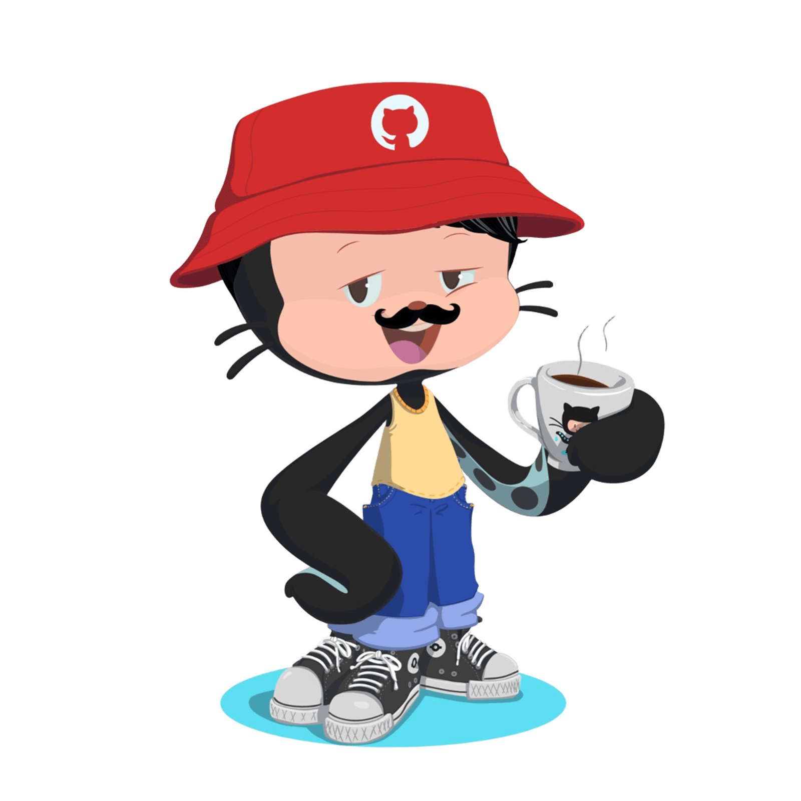

<h1 align="center">
  Olá, eu sou o Raul Migliari! 👨‍💻
</h1>

  

---

## 🧠 Sobre mim

Almejo me profissionalizar em full stack com paixão por **projetos reais**, **arquitetura web escalável** e **automação inteligente**. Atuo com tecnologias modernas, focando em segurança, usabilidade e organização de código limpo.

🎓 Estudante do último ano de **Engenharia de Software**  
⚡ Foco em **sistemas web inteligentes**, integração com banco de dados e autenticação segura  
💼 Em construção de sistemas como **VetCare**, **DimaSun** e outros projetos reais

---

## 🚀 Tecnologias que utilizo

  

---

## 💼 Projetos em Destaque

### 🐾 VetCare – Sistema para Clínicas Veterinárias
> Gestão de pets, prontuários e consultas. Autenticação com login seguro. Área do cliente e da clínica com MongoDB e Supabase.

### ☀️ DimaSun – Energia Solar com IA
> Plataforma de recomendação de empresas de energia solar, com interface moderna e suporte à tomada de decisão consciente.

### 📞 Call Center (Twisted)
> Central de atendimento em Python usando o framework Twisted. Projeto assíncrono com comunicação em tempo real e fila de chamadas.

---

## 📊 Github Stats

  
  

---

## 📫 Contato

  
  
  

---

  

---

<table align="center">
  <tr>
    <td>
      <em>✨ “Construindo soluções de verdade, uma linha de código por vez.” ✨</em>
    </td>
    <td>
      
    </td>
  </tr>
</table>

